  

### Hi, ich bin Jan 👋

Als **AI & Automation Specialist** unterstütze ich Teams dabei, ihre internen Prozesse mit **n8n** und smarten **Notion-Integrationen** zu skalieren. Meine Leidenschaft ist es, aus Ideen funktionierende Prototypen (PoCs) zu bauen und die besten davon zur Produktionsreife zu bringen.

---

### 💡 Meine Kernkompetenzen

-   **Prozessoptimierung:** Analyse und Neugestaltung von Workflows für maximale Effizienz.
-   **API-Integrationen:** Nahtlose Anbindung verschiedener Tools und Systeme über REST-APIs.
-   **Proof-of-Concept Entwicklung:** Schnelle Validierung von Automations-Ideen mit klarem Fokus auf den Business-Value.
-   **System-Architektur:** Aufbau von skalierbaren und wartbaren Automations- und Wissensmanagement-Systemen.

---

### 🚀 Woran ich arbeite

-   Skalierbare Automations-Lösungen mit **n8n**, APIs und **JavaScript/Node.js**.
-   Zentralisierte Wissensdatenbanken in **Notion**, die sich nahtlos in andere Tools integrieren.
-   Entwicklerfreundliche Dokumentationen für komplexe Automations-Prozesse.
-   Frameworks für Governance und Monitoring von unternehmenskritischen Automatisierungen.

---

### 🛠️ Mein Tech-Stack

  
  &nbsp; &nbsp;
  
  &nbsp; &nbsp;
  
  &nbsp; &nbsp;
  
  &nbsp; &nbsp;
  
  &nbsp; &nbsp;
  
  &nbsp; &nbsp;
  

---

### 📫 Kontakt & Profile

  
  &nbsp; &nbsp;
  

