<!-- README.md for eljarno -->
<!-- Animated header with a wave effect -->

### About me
I’m an **AI & Automation Specialist** focused on scaling internal automation with **n8n**, Notion integrations and pragmatic JavaScript.  
My passion: building Proof-of-Concepts to validate ideas, and hardening the winners for production.

<!-- Typing animation tagline -->

---

## 🔭 What I build
- Scalable automations and integrations using **n8n**, APIs, and JavaScript  
- Knowledge systems with **Notion** and developer-friendly documentation  
- **Proof-of-Concept frameworks** for automation governance and observability  

## 🛠 Tools & Tech
- n8n · Notion · JavaScript · Node.js · Docker · Git  
- Python · REST APIs · Postgres  

---

## 📫 Contact
- LinkedIn: [your-linkedin](https://www.linkedin.com/)  
- Email: your.email@example.com  

---

<!-- Animated footer with wave -->

